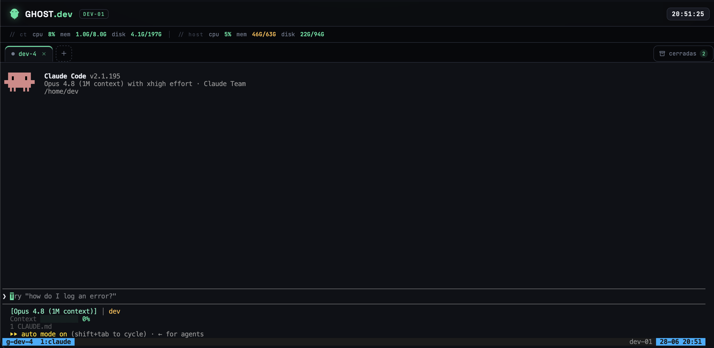
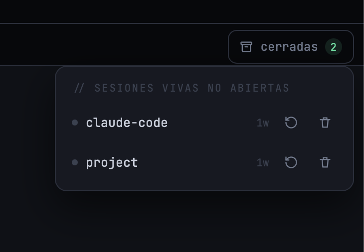
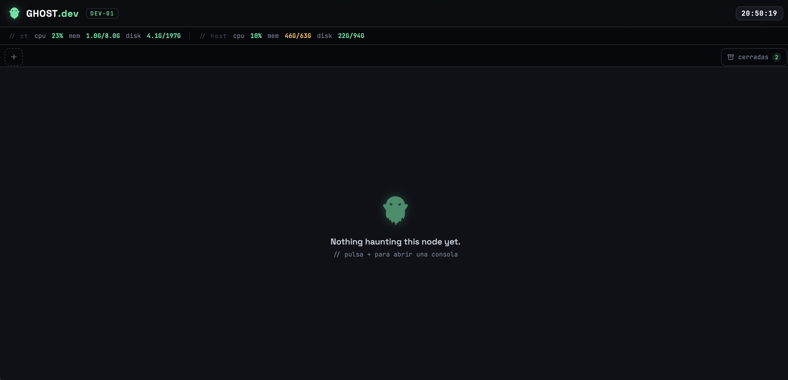

<div align="center">


# GHOST.dev

### Run Claude Code in your browser — a self-hosted, multi-session web terminal that shows you which agent needs you.

[](https://github.com/hacktheghost/ghostdev/stargazers)
[](https://github.com/hacktheghost/ghostdev/issues)
[](https://github.com/hacktheghost/ghostdev/commits/main)
[](LICENSE)
[](#quickstart)
[](#contributing)
[](https://claude.com/claude-code)

</div>

---

Open a tab, type `claude`, and you have a full Claude Code session in the browser — backed by a
**persistent tmux session** that survives refreshes, disconnects and reboots. Open a second tab for
another repo. A third. **Each tab's status dot tells you what Claude is doing in that session** —
working, waiting for your message, or blocked on a permission prompt — so when you're juggling
several agents at once you can see, at a glance, which one needs you.

That last part is the point. Plain web terminals (ttyd, wetty, gotty) give you a shell in a browser.
ghostdev gives you a **dashboard for parallel Claude Code sessions**.

<p align="center">
  
</p>

<div align="center">

[Why](#why) · [How it compares](#how-it-compares) · [Features](#features) · [Quickstart](#quickstart) · [Configuration](#configuration) · [Native install](#native-install-no-docker) · [How it works](#how-it-works) · [Contributing](#contributing)

</div>

## Why

Running several Claude Code sessions in parallel is now normal — one per repo, per feature, per
experiment. The problem isn't starting them, it's **knowing which one is blocked waiting for you**
while the others keep working. ghostdev surfaces that:

- 🟢 **green dot** — Claude is idle, waiting for your next message
- ⚪ **grey dot** — Claude is working (thinking / generating / running tools)
- 🟠 **amber dot (pulsing)** — Claude is blocked on a permission prompt → go approve it
- and the browser tab title shows an attention counter like `(2) GHOST.dev`

## How it compares

|  | **ghostdev** | ttyd / wetty / gotty | code-server |
|---|:---:|:---:|:---:|
| Web terminal | ✅ | ✅ | ⚠️ full IDE |
| Multiple sessions as tabs | ✅ | ❌ one shell | ➖ |
| Persistent tmux per tab | ✅ | ❌ | ❌ |
| **Per-tab Claude status** (working / waiting / needs permission) | ✅ | ❌ | ❌ |
| Reopen / kill detached sessions | ✅ | ❌ | ➖ |
| Live system stats top bar | ✅ | ❌ | ❌ |
| Claude Code preinstalled | ✅ | ❌ | ❌ |
| Footprint | tiny (ttyd + nginx + Node) | tiny | heavy |

## Features

- **Browser tabs → tmux sessions.** Each tab is an attach-or-create tmux session. Close the tab and
  the session keeps running; reopen it later and pick up exactly where you left off.
- **Claude-aware status dots** per tab + attention counter in the title. ([how it works](docs/claude-status.md))
- **"Closed sessions" drawer** — every live session that isn't open as a tab, ready to reopen or kill.
- **Live stats top bar** — CPU / memory / disk of the host, plus its IP. ([optional Proxmox host stats](docs/proxmox-stats.md))
- **Built-in file manager** — a side panel to browse, upload, download (or pull straight from a URL),
  rename, delete and edit files, confined to a configurable root. ([docs](docs/file-explorer.md))
- **Multilingual UI** — English, Spanish, Portuguese & French, auto-detected with a switcher in the
  top bar and easy to extend.
- **Persistent everything** — sessions, scrollback, shell history and your Claude Code login all
  survive restarts (Docker volume / native home dir).
- **One image, one command.** ttyd + tmux + nginx + a tiny Node backend, with Claude Code preinstalled.
- **Polished dark theme**, tuned `tmux` and `bash`, JetBrains Mono, mobile-friendly layout.

<p align="center">
  
  
</p>

## Quickstart

```bash
git clone https://github.com/hacktheghost/ghostdev.git
cd ghostdev
cp .env.example .env          # tweak the label/port if you like
docker compose up -d
```

Open **http://127.0.0.1:7680**, click **+**, type `claude`, and log in. Done.

> First run downloads the ttyd binary and installs Claude Code into the image, so the initial build
> takes a minute. After that it's instant.

### ⚠️ Before you expose it

A web terminal is a **remote shell**. ghostdev binds to `127.0.0.1` on purpose. To reach it from
another machine, put it behind a VPN or a reverse proxy with auth — **don't** just bind it to the
internet. This matters; read **[docs/SECURITY.md](docs/SECURITY.md)** (it's short).

## Configuration

All via `.env` (see [`.env.example`](.env.example)):

| Variable | Default | What it does |
|---|---|---|
| `GHOSTDEV_HOST_ADDR` | `127.0.0.1` | Host address the container publishes to |
| `GHOSTDEV_HOST_PORT` | `7680` | Host port |
| `GHOSTDEV_NODE_LABEL` | hostname | Label shown in the top bar |
| `GHOSTDEV_SHOW_PUBLIC_IP` | `true` | Show WAN IP in the top bar (calls api.ipify.org) |
| `GHOSTDEV_BASIC_AUTH` | _(empty)_ | Optional `user:pass` HTTP basic auth on the terminal |
| `GHOSTDEV_SHELL` | `tmux new -A -s` | Command each tab runs |
| `GHOSTDEV_FILES_ENABLED` | `true` | Built-in file explorer ([docs](docs/file-explorer.md)) |
| `GHOSTDEV_FILES_ROOT` | user home | Directory the file explorer is confined to |
| `GHOSTDEV_FILES_READONLY` | `false` | `true` = browse/download only, no writes from the UI |
| `GHOSTDEV_PROXMOX_*` | _(off)_ | Optional read-only Proxmox host stats ([docs](docs/proxmox-stats.md)) |

Build without Claude Code (vanilla web terminal): `docker compose build --build-arg INSTALL_CLAUDE=false`.

## Native install (no Docker)

Installs ttyd + nginx + the stats backend as systemd services:

```bash
sudo ./install/install.sh --user youruser --port 7680 --label my-box
```

Run `./install/install.sh --help` for all options. It binds to `127.0.0.1` by default — same
security note applies.

## How it works

```
                 ┌───────────────────────── nginx ─────────────────────────┐
  browser ─────▶ │  /            → static UI  (web/index.html, the dashboard)│
                 │  /tty   (ws)  → ttyd :7681 → tmux attach-or-create        │
                 │  /api/* (json)→ stats :9090 (CPU/mem/disk, session state) │
                 └──────────────────────────────────────────────────────────┘
```

- **ttyd** serves the terminal; the URL's `?arg=<name>` becomes the tmux session name, so each tab
  maps to its own persistent session.
- **`stats/server.js`** (Node stdlib, no deps) serves `/stats`, lists tmux sessions (annotating each
  with its Claude state by scraping the visible pane), and backs the file explorer at `/api/fs/*`
  (list / read / upload / rename / delete / fetch-url), confined to `GHOSTDEV_FILES_ROOT`. No
  secrets, no external services.
- The dashboard (`web/index.html`) manages tabs, the closed-sessions drawer, the file panel, the
  live top bar, and the EN/ES/PT/FR translations.

## Roadmap

- [ ] Optional desktop/web push when a session flips to `perms` or `input`
- [ ] Per-session working-directory / repo labels
- [ ] Theme switcher
- [ ] Pluggable status detectors for other CLI agents

## Contributing

Issues and PRs are welcome — bug reports, new status detectors for other CLI agents, themes, or
packaging for more distros. Filing a status-detection bug? Paste a `tmux capture-pane -p` of the
screen that was misread (see [docs/claude-status.md](docs/claude-status.md)) so it's easy to fix.

If ghostdev is useful to you, **a ⭐ helps other people find it.**

## Acknowledgements

Standing on the shoulders of [ttyd](https://github.com/tsl0922/ttyd),
[tmux](https://github.com/tmux/tmux), [nginx](https://nginx.org), and
[Claude Code](https://claude.com/claude-code).

## License

MIT — see [LICENSE](LICENSE).

## Star History

<a href="https://star-history.com/#hacktheghost/ghostdev&Date">
  <picture>
    <source media="(prefers-color-scheme: dark)" srcset="https://api.star-history.com/svg?repos=hacktheghost/ghostdev&type=Date&theme=dark" />
    <source media="(prefers-color-scheme: light)" srcset="https://api.star-history.com/svg?repos=hacktheghost/ghostdev&type=Date" />
    
  </picture>
</a>
